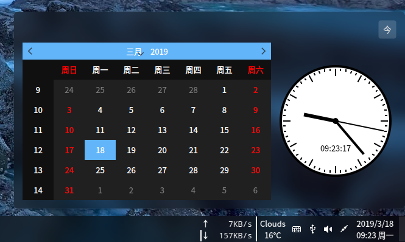
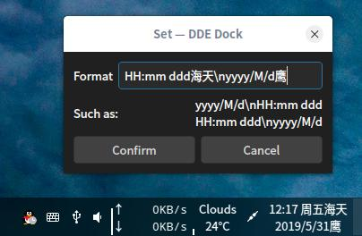

# DDE_DOCK_DateTime
深度 Linux 系统日期时间任务栏插件，第一行显示 年/月/日，第二行显示 时:分 星期 ，单击显示日历控件。  

  
  

安装：终端管理员身份运行 ./install.sh  
卸载：终端管理员身份运行 ./unstall.sh

开发依赖：  
sudo apt-get install dde-dock-dev

### V1.3
时间格式可以设置  
  

### V1.2
图形钟表

### V1.1
点击显示日历

### V1.0
双行日期、时间